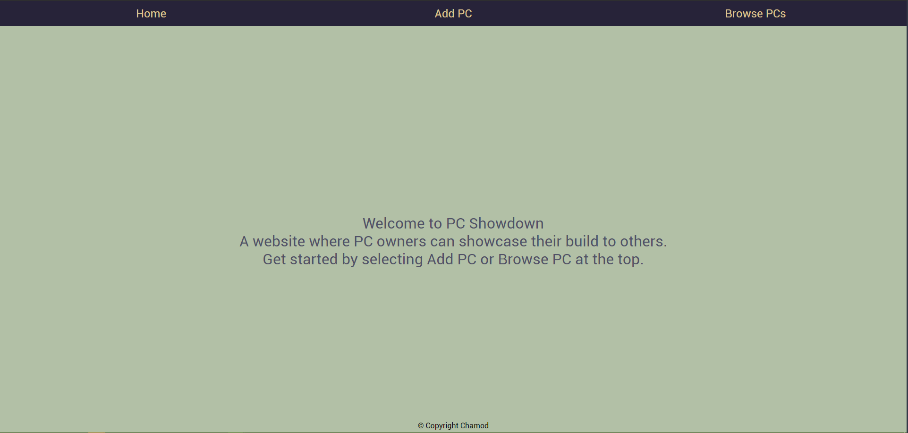
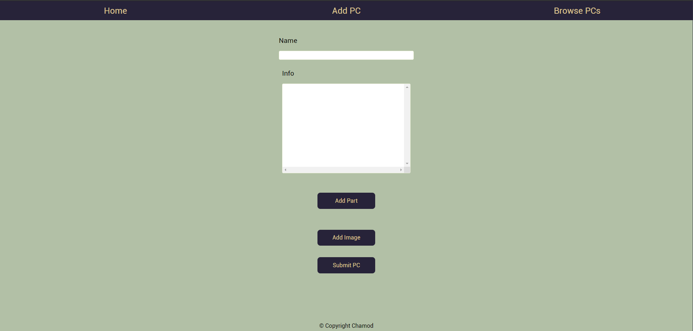
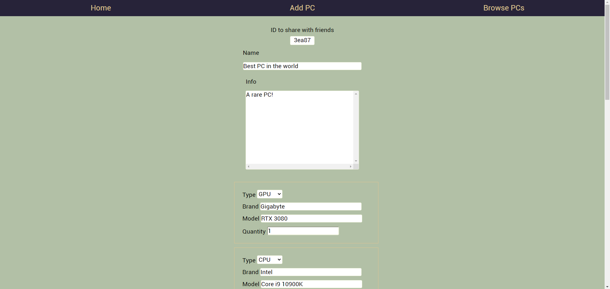

# PCShowdown
A website that lets users add, edit, and remove PCs.\
Users can share links to PCs with others or browse PCs.

## Technologies used
  Backend:\
   * [Golang](https://golang.org/) 
   * [SQlite3](https://www.sqlite.org/index.html) 
  Frontend:\
   * [TypeScript](https://www.typescriptlang.org/)
   * [jQuery](https://jquery.com/) 
   * [Handlebars](https://handlebarsjs.com/) 

## Screenshots






## Usage

### Prerequisites

Install the latest version of NPM
* npm

  ```sh
  npm install npm@latest -g
  ```
  
 Install the latest version of [Golang](https://golang.org/dl/) 
 
 ### Installation
 
1. Install NPM packages

   ```sh
   npm install
   ```
2. Install [Goose](https://github.com/pressly/goose)

    ```sh
    go get -u github.com/pressly/goose/cmd/goose
    ```

### Initialization

Initialize the database

  Go to migrations directory

    ```sh
    cd migrations
    ```

  Initialize the database  
    
    ```sh
    [goose directory] sqlite3 ../pcshowdown.db up
    ```

Run the go program

  ```sh
  go run .
  ```

## License
[GNU GPLv3](https://choosealicense.com/licenses/gpl-3.0/)
